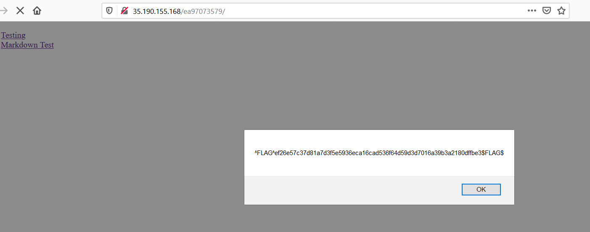
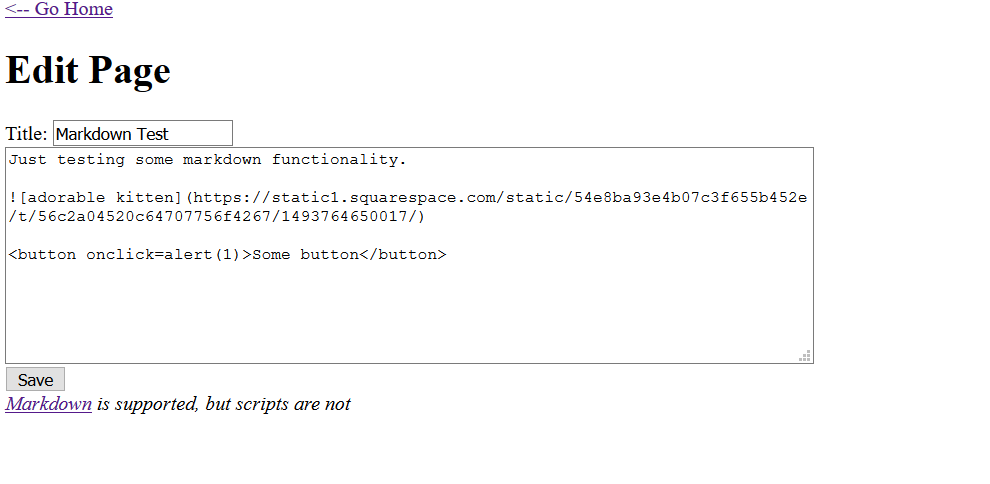

## Micro-CMS v1

- Flag0 , hint: Try creating a new page

  Người ta cho hint vậy, nhìn kiểu này rất giống lỗi XSS,  vì vậy thử test XSS xem sao
  
  Tạo xong về home thì được cái này
  

  ^FLAG^ef26e57c37d81a7d3f5e5936eca16cad536f64d59d3d7016a39b3a2180dffbe3$FLAG$

- Flag2 , hint: 
    Sometimes a given input will affect more than one page
    The bug you are looking for doesn't exist in the most obvious place this input is shown

  Kiểu như nó bảo mình đôi khi một đầu vào nhất định sẽ ảnh hưởng đến một trang, lỗi đang tìm không tìm kiếm ở nơi rõ ràng nhất
  Lúc đầu khi mình tạo page mới thì xem source thấy url nó tạo có dạng /page/:id và lúc mình tạo page đầu tiên thì nó tạo /page/8
  mà trước đó chỉ có 2 page, vậy những page kia đâu, mình dò từ page 3 đến page 7 thì thấy k có gì, cơ mà còn chức năng edit, thế là dò
  lần lượt url /page/edit/3 -> /page/edit/7 , tới page 5 thì mình thấy flag
  

  ^FLAG^2d08be24878f619fa5b871756f595643df3792530080fd02408f6f348f482631$FLAG$

- Flag3
  Mình vào trang /page/edit/1 , kiểm tra lỗi sql injection thử bằng cách thêm dấu ' vào sau url thì ra flag
  

  ^FLAG^ea45f2393c51ac2466b0b100a57ddce29fbda8a786f6bce6c61763d4829940c2$FLAG$

- Flag4 
  Mình dò đi dò lại chả biết test cái nào nữa, chợt thấy cái markdown test, nãy giờ không để ý đến nó. Bấm vào edit page thì thấy có cái button
  thế là thì thêm tí mắm muối <button onclick=alert(1)>Some button </button>
  

  Đây cũng là lỗi xss, khi click vào button sẽ thực thi lệnh alert(1)
  

  và cuối cùng ra flag
  

  ^FLAG^c28d669d766d6f46400e1395d2d2fea4985d421650d68ed5ae87a69034ab9ed1$FLAG$
  